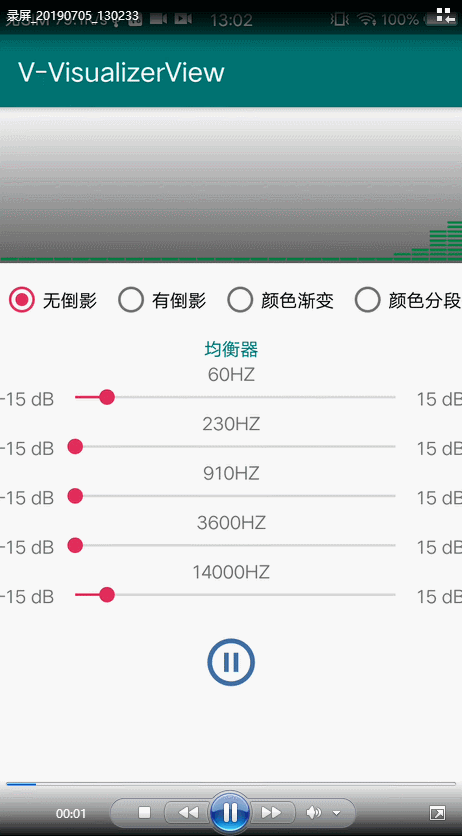

# V-VisualizerView -音频随音谱率动跳动动画效果
* support androidX and Kotlin

[](https://www.apache.org/licenses/LICENSE-2.0)
[](https://android-arsenal.com/details/1/6001)
[](https://bintray.com/vension/vensionCenter/V-VisualizerView/_latestVersion)
[](https://android-arsenal.com/api?level=21)
[](https://img.shields.io/badge/Author-Vension-orange.svg?style=flat-square)

## 效果预览
<p>
    
</p>
compile 'kv.vension:visualizerview_kotlin:1.0.0'

## Download[](https://bintray.com/vension/vensionCenter/V-VisualizerView/_latestVersion)
``` gradle
 implementation 'me.vension:hotlableview:_latestVersion'
```

## update
* **V1.0.0**: <初始化版本>

## Usage

* **具体使用查看demo示例**

### attrs

| Attribute 属性         | Description 描述 |
|:---				    |:---|
| hasShadow             | 是否有倒影，默认false      |
| shadowNum             | 倒影音频块数，默认5         |
| shadowColor           | 倒影颜色，默认Color.GRAY    |
| visualColor           | 音频块颜色，默认Color.RED   |
| isGradient            | 音频块颜色是否渐变，默认false|
| colorStart            | 渐变开始颜色，默认"#A47586" |
| colorCenter           | 渐变中间颜色，默认"#C36084" |
| colorEnd              | 渐变结束颜色，默认"#F14380" |

## License
```
 Copyright 2019, Vension

   Licensed under the Apache License, Version 2.0 (the "License");
   you may not use this file except in compliance with the License.
   You may obtain a copy of the License at

       http://www.apache.org/licenses/LICENSE-2.0

   Unless required by applicable law or agreed to in writing, software
   distributed under the License is distributed on an "AS IS" BASIS,
   WITHOUT WARRANTIES OR CONDITIONS OF ANY KIND, either express or implied.
   See the License for the specific language governing permissions and
   limitations under the License.
```
